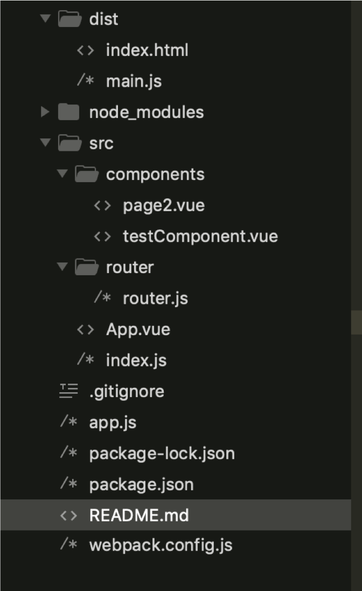
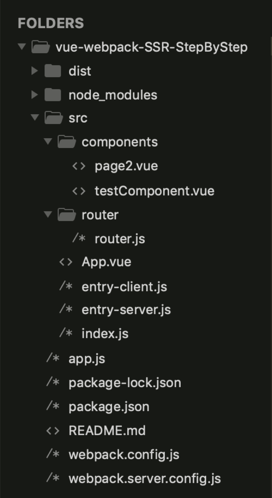
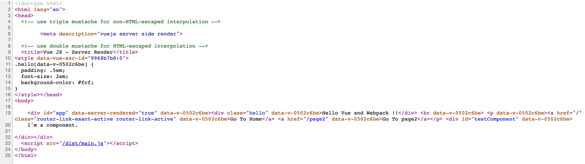

# vue-webpack-SSR-StepByStep
# 手把手建立Vue-SSR開發環境

## 前言

將SPA調整成SSR，如果你不知道什麼是SSR，我推薦你看一下[這篇文章](https://medium.com/@hulitw/introduction-mvc-spa-and-ssr-545c941669e9)。

Vue的世界裡有個東西叫做 NUXT.js，其實要做SSR的開發環境沒這麼困難。但當然，偶爾也會想要自虐一下。


如果你錯過了最前頭關於webpack與vue的設定，我建議你回去複習一下：

* github請點[https://github.com/yichunsung/webpack-vue-manual_configuration](https://github.com/yichunsung/webpack-vue-manual_configuration)

* 我的個人網站文章[]()

* Devs.tw : [https://devs.tw/post/60](https://devs.tw/post/60)


如果你錯過了vue-spa的部分，最好也回去看看：

* github請點[https://github.com/yichunsung/vue-webpack-SPA-StepByStep](https://github.com/yichunsung/vue-webpack-SPA-StepByStep)

* 我的個人網站文章[]()

* Devs.tw : [https://devs.tw/post/189](https://devs.tw/post/189)

如果都瞭解了，那就開始了！

## 出發之前的打卡留念

先來一張看看原先SPA的檔案結構長怎樣。




## 安裝必要套件

基於你已經完成建置Vue-SPA的開發環境後，後面的步驟都是在SPA環境完成之後的動作。

安裝 vue-server-renderer

vue-server-render: Vue library for SSR.

```bat

npm install vue-server-renderer --save

```

安裝 webpack-merge

webpack-merge: merge webpack configuration的工具

```bat

npm install webpack-merge --save

```

## Webpack configuration 重新設定

1. 先將 原先進入點	 ```index.js``` 重新命名為 ```entry-client.js``` ，這是給瀏覽器端的進入點。

2. ```Webpack.config.js```中 path修改

3. 將Webpack.config.js調整成client端的設定，完整設定如下，根據官方文件使用TerserPlugin。

```javascript

const path = require('path');
const webpack = require('webpack');
const TerserPlugin = require('terser-webpack-plugin');
const VueLoaderPlugin = require('vue-loader/lib/plugin');

module.exports = {
  entry: './src/entry-client.js',
  output: {
    path: path.resolve(__dirname, './dist'),
    publicPath: '/dist/',
    filename: 'main.js'
  },
  module: {
    rules: [
      {
        test: /\.vue$/,
        loader: 'vue-loader'
      },
      // this will apply to both plain `.js` files
      // AND `<script>` blocks in `.vue` files
      {
        test: /\.js$/,
        loader: 'babel-loader'
      },
      // this will apply to both plain `.css` files
      // AND `<style>` blocks in `.vue` files
      {
        test: /\.css$/,
        use: [
          'vue-style-loader',
          'css-loader'
        ]
      },
      {
        test: /\.(png|jpg|gif|svg)$/,
        loader: 'file-loader',
        options: {
          name: '[name].[ext]?[hash]'
        }
      }
    ]
  },
  plugins: [
    // make sure to include the plugin for the magic
    new VueLoaderPlugin()
  ],
  resolve: {
    alias: {
      'vue$': 'vue/dist/vue.js'
    },
    extensions: ['*', '.js', '.vue', '.json']
  },
  devServer: {
    historyApiFallback: true,
    noInfo: true,
    overlay: true
  },
  performance: {
    hints: false
  },
  devtool: '#eval-source-map',
  optimization: {
    minimizer: [new TerserPlugin()],
  },
  
}

if (process.env.NODE_ENV === 'production') {
  module.exports.devtool = '#source-map'
  // http://vue-loader.vuejs.org/en/workflow/production.html
  module.exports.plugins = (module.exports.plugins || []).concat([
    new webpack.DefinePlugin({
      'process.env': {
        NODE_ENV: '"production"'
      }
    }),
    /*
    new webpack.optimize.UglifyJsPlugin({
      sourceMap: true,
      compress: {
        warnings: false
      }
    }),
    */
    new webpack.LoaderOptionsPlugin({
      minimize: true
    })
  ])
}

```

4. 新增一個檔案```webpack.server.config.js```，這是給server端的設定檔。

5. 這裡會調用前面安裝的webpack-merge套件去執行merge。

```javascript
var path = require('path')
var webpack = require('webpack')
var merge = require('webpack-merge')
var baseWebpackConfig = require('./webpack.config.js')
var webpackConfig = merge(baseWebpackConfig, {
  target: 'node',
  entry: {
    app: './src/entry-server.js'
  },
  devtool: false,
  output: {
    path: path.resolve(__dirname, './dist'),
    filename: 'server.bundle.js',
    libraryTarget: 'commonjs2'
  },
  externals: Object.keys(require('./package.json').dependencies),
  plugins: [
    new webpack.DefinePlugin({
      'process.env': 'production'
    }),
    /*
    new webpack.optimize.UglifyJsPlugin({
      compress: {
        warnings: false
      }
    })*/
  ]
})
module.exports = webpackConfig

```

到此已經完成webpack的設定了。

## index.html重新設定

1. 讓標題，```<meta>``` 等html tag先渲染出來。

2. 注意因為搭配server，引入的script 要改成絕對路徑。

```{html}
<!doctype html>
<html lang="en">
<head>
  <!-- use triple mustache for non-HTML-escaped interpolation -->
  {{{ meta }}}
  <!-- use double mustache for HTML-escaped interpolation -->
  <title>{{ title }}</title>
</head>
<body>
	
    <!--vue-ssr-outlet-->
  <script src="/dist/main.js"></script>
</body>
</html>
```

## 主要的.vue file設定

一般來說是取名為***App.vue***，幾乎是沒有額外的更動，但為了讀者方便，一併附上。

```vue
<template>
  <div id="app">
  	<div class="hello">Hello {{ who }}</div> <br>
  	<p>
      <router-link to="/">Go To Home</router-link>
      <router-link to="/page2">Go To page2</router-link>
    </p>
  	<router-view></router-view>

  </div>
</template>

<script>
export default {
  data() {
    return {
      who: 'Vue and Webpack !!'
    }
  }
};
</script>

<style scoped>
.hello {
  padding: .5em;
  font-size: 2em;
  background-color: #fcf;
}
</style>
```

## router.js 改寫

把router.js改成輸出一個function。

```javascript
import Vue from 'vue';
import Router from 'vue-router';

// Components
import testComponent from '../components/testComponent.vue';
import page2 from '../components/page2.vue';

// Coding
Vue.use(Router);

export function createRouter(){
	return new Router({
		
		routes: [
		    {
				path: '/',
				name: 'testComponent',
				component: testComponent
		    },
		    {
		    	path: '/page2',
				name: 'page2',
				component: page2
		    }
		    
		    
		]	   
	});
}
 
 

```

## index.js 的改寫

一樣改成輸出function。

```javascript
import Vue from 'vue';
import App from './App.vue';
import { createRouter } from './router/router.js';

// 輸出一個function

export function createApp() {
  // 建立 router
  const router = createRouter();

  const app = new Vue({
    router,
    // the root instance simply renders the App component.
    render: h => h(App)
  });

  return { app, router };
}
```

## Client entry point

新增一個檔案， ***entry-client.js***。

引入 index.js 輸出的function，並且在這邊建立一個client端的渲染。

```javascript
//client-entry.js
import { createApp } from './index.js';

const { app } = createApp()

// this assumes App.vue template root element has `id="app"`
app.$mount('#app')

```

## Server entry point

接著是Server端入口的建立，新增一個檔案， ***eentry-server.js***。

```javascript
//entry-server.js
import { createApp } from './index.js';

export default  function(context){
  // since there could potentially be asynchronous route hooks or components,
  // we will be returning a Promise so that the server can wait until
  // everything is ready before rendering.
  return new Promise((resolve, reject) => {
    const { app, router } = createApp();

    // set server-side router's location
    router.push(context.url);
      
    // wait until router has resolved possible async components and hooks
    router.onReady(() => {
      const matchedComponents = router.getMatchedComponents();
      // no matched routes, reject with 404
      if (!matchedComponents.length) {
        return reject({ code: 404 });
      }
  
      // the Promise should resolve to the app instance so it can be rendered
      resolve(app);
    }, reject);
  });
}

```
## Express-node.js的設定

這邊就是你啟動後端server的js檔，***app.js***。

```javascript
//server.js
const express = require('express');
const app = express();
const fs = require('fs');
const path = require('path');
//obtain bundle
const bundle =  require('./dist/server.bundle.js');
//get renderer from vue server renderer
const renderer = require('vue-server-renderer').createRenderer({
  //set template
  template: fs.readFileSync('./dist/index.html', 'utf-8')
});

app.use('/dist', express.static(path.join(__dirname, './dist')));

//start server
app.get('/', (req, res) => { 
    
  bundle.default({ url: req.url }).then((app) => {    
    //context to use as data source
    //in the template for interpolation
    const context = {
      title: 'Vue JS - Server Render',
      meta: `
        <meta description="vuejs server side render">
      `
    };

    renderer.renderToString(app, context, function (err, html) {   
      if (err) {
        if (err.code === 404) {
          res.status(404).end('Page not found')
        } else {
          res.status(500).end('Internal Server Error')
        }
      } else {
        res.end(html)
      }
    });        
  }, (err) => {
    console.log(err);
    console.log("stop");
  });  
});  


// 啟動伺服器在 http://localhost:8888/

let port = process.env.PORT || 8888;

app.listen(port, function(){
  console.log("Start")
});

```

整個完成後，我們的資料夾目錄是長這樣：



## package.json 設定

把webpack打包的指令和啟動Server的指令寫在一起。

```json

"scripts": {
  "start": "npm run build && npm run start-server",
  "build": "npm run build-client && npm run build-server",
  "build-client": "cross-env NODE_ENV=production webpack --progress --hide-modules",
  "build-server": "cross-env NODE_ENV=production webpack --config webpack.server.config.js --progress --hide-modules",
  "start-server": "node server.js"
}

```

## 執行

```bat
npm run start
```

沒意外的話就打包完成後，Server執行也成功了。

只單看啟動後的畫面並沒有感覺，可是當你檢視網頁原始碼時會發現SSR會先把```<body></body>```中的內容渲染出來，就像下圖這樣：



其實SSR重點就是為了SEO的優化而做的，讓搜尋引擎先爬到html裡的內容有助於網頁的搜尋排名。


## Reference

[https://ssr.vuejs.org/guide/](https://ssr.vuejs.org/guide/)

[https://vuejsdevelopers.com/2017/12/11/vue-ssr-router/](https://vuejsdevelopers.com/2017/12/11/vue-ssr-router/)

[https://medium.com/frontend-fun/vuejs-server-side-render-with-vue-router-e73d51699873](https://medium.com/frontend-fun/vuejs-server-side-render-with-vue-router-e73d51699873)